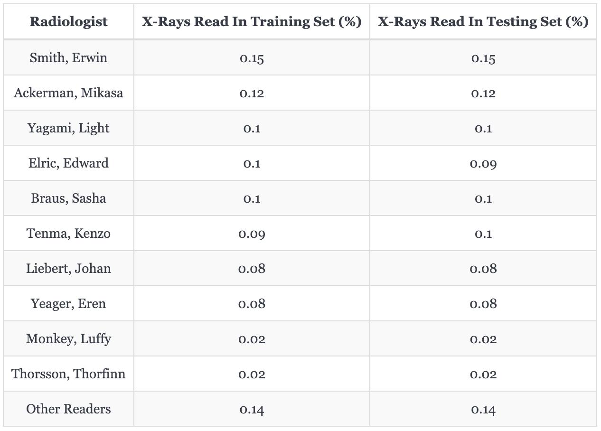
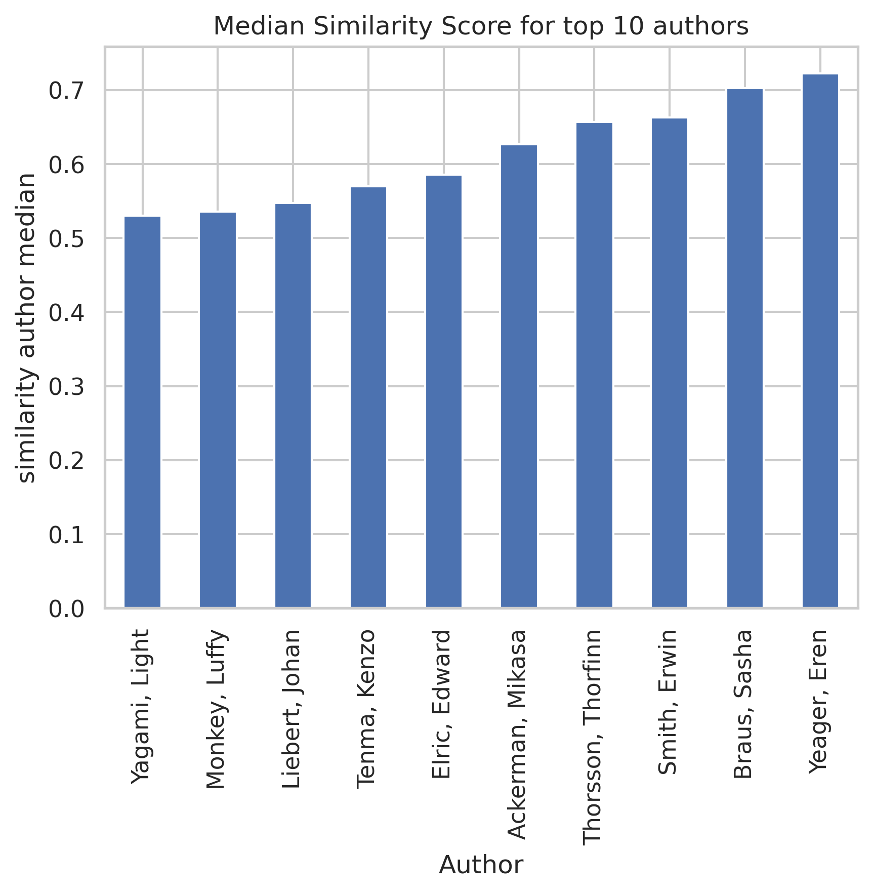

## Overview

This is a a Data Science Capstone Project investigated and put together by **Luke Taylor**, **Muchan Li**, and **Raymond Song** under the mentorship of ***Albert Hsiao, MD, PhD***. All are affiliated with the Halicioglu Data Science Institute at UC San Diego. Professor Hsiao is additionally affiliated with UC San Diego Health and Radiology Department.

  
  
  
  

## Problem Statement and Motivation

Deep learning models like convolutional neurla networks (CNNs) have demonstrated promising ways of application in automating radiograph analysis, detecting conditions such as pulmonary edema, pneumothorax, and so forth. However, vast amount of data other than the radiographs has been left out, such radiologist reports, in the modeling process and can potentially make automation and predicition more accurate and usable. Inspired by advancements in Large Language Models (LLMs) and Vision Transformers (ViTs), we’re exploring multi-modal models that integrate text and image data for improved results.

## Objectives

1. Navigate how multi-modal models are used to leverage both X-Ray reports and images to generate reports.
2. Assess whether the generated reports mimic the style of reports written by the expert readers.
3. Assess the accuracy of the generated reports in identifying pathologies.
   1. **Determine whether additional context in the text input of an LLM improves generated text outcomes**.
4. Explore the effect of prompt engineering on report generation and accuracy.
   1. **Evaluate and quantify the improvement in the LLM for Chest X-rays given more context**.

## Methods

- About 100K Chest Radiographs and their text reports from UCSD Health.
  - We split our data so that there are 96119 x-ray images and corresponding reports for training and 2088 pairs for testing.
- Fine-tuned a Large Language Model (LLM) with vision capabilities instead of training both a vision CNN tower and a LLM from scratch
- Using Large Language and Vision Assistant v1.5 (LLaVA, see [1][2][3]) as the base model which is based on Vicuna 13B v1.5 and CLIP ViT-L/14 visual encoder
- Input is an X-ray and then a prompt that may include information about the previous clinical history and additional patient context.
- Ground truth output is actual radiologist report for the corresponding X-ray
- The fine-tuning of the model was done using a Nvidia RTX A6000 with LORA adapters due to GPU memory constraints.
- Evaluated with cosine similarity scores between bio term specific sentence transformer embeddings.
- Extracted label probabilities for common lung conditions using Facebook BART zero shot classification to evaluate diagnostic accuracy.

## Findings and Results

In this section, we will present the insights obtained from analyzing the radiograph reports and training and testing different tricks to LLaVA model. We will focus our presentation more on the latter.

### Expert Radiologists

As presented above, we identified 10 most prominent radiologist readers (anonymized with pseudonyms) from our X-rays and reports dataset. They are in combine responsible for 86% of the readings in both the training and testing set.

### Similarity Between Generated Reports and Expert Ground Truths

As shown by the above two figures, the length in number of characters of radiologist-provided reports and LLaVA-generated reports (using **context-embedded** prompt, see below) **impression** sections are comparable. The only identifiable shortcoming is that LLaVA does not tend to generate longer reports well, characterized by the smaller bar in the middle between *200 characters* and *400 characters*.

The above two figures instead present the length in number of characters of radiologist-provided reports and LLaVA-generated reports (obtained using **context-embedded** prompt) **findings** sections. Both are once again comparable, except that LLaVA now tends to produce longer **findings** than ground truths.

Presented above is the test-set median cosine similarity scores between the semantic embeddings of LLaVA generated reports and radiologist-provided reports, categorized into each radiologist of the top 10 most prominent individual. Most notably, the median score for even the least similar radiologist is still above 0.5, at around 0.53. There are also 5 radiologists that have scores above 0.6, indicating that LLaVA did in fact generate reports in styles similar to original readers' writing.

Click on each radiologist's name below to learn more in detail model's performance with respect to that individual:

  
👨‍⚕️👩‍⚕️ Dr. Eren Yeager

  

  
👨‍⚕️👩‍⚕️ Dr. Sasha Braus

  

  
👨‍⚕️👩‍⚕️ Dr. Erwin Smith

  

  
👨‍⚕️👩‍⚕️ Dr. Thorfinn Thorsson

  

  
👨‍⚕️👩‍⚕️ Dr. Mikasa Ackerman

  

  
👨‍⚕️👩‍⚕️ Dr. Edward Elric

  

  
👨‍⚕️👩‍⚕️ Dr. Kenzo Tenma

  

  
👨‍⚕️👩‍⚕️ Dr. Johan Liebert

  

  
👨‍⚕️👩‍⚕️ Dr. Luffy Monkey

  

  
👨‍⚕️👩‍⚕️ Dr. Light Yagami

  

### Prompts Constructed

The prompt on the left is designed to be generic, similar to the one used in [4] for querying model responses. It serves as our benchmark. The prompt on the right is more context-embedded and -specific. It's design is largely inspired by the spirits of chain-of-thought prompting proposed in [5]. We aim to embed more patient history and x-ray context in prompting the model to give a more holistic reading of the x-ray, treating as if it is a real diagnostic expert.

---

### Pathology Detection Outcomes

#### X-Rays and Ground Truths

  
  <figcaption>Pathology Present (Left) vs. Normal (Right) Chest X-Ray</figcaption>

---

#### Model Generated Reports

One can see that when LLaVA is prompted with the baseline generic prompt, the readings responses to both X-rays, regardless of pathological entities, are simply direct copies of each other. This indicates that either LLaVA has not learned any X-ray specific imaging feature and just memorized the report text (since the prompt are first fed to the model via fine-tuning), or that the prompt is not specific enough to elicit reasoning.

Then, when we prompted LLaVA with the context-embedded prompt, we can see that LLaVA instead can articulate distinct findings with regard to each X-ray. Specifically, since we provided the corresponding radiologist reader, the model did better in memorizing and mimicking reader-specific reporting style. Moreover, the seemingly increased pathology detection accuracy--as an example, **LLaVA correctly identified interval removal of a right IJ (sheath)**--suggests that model is now better at comprehending the task and retrieving the relevant vision and language features.

---

#### Quantified Outcomes

According to the ROC plot on the left, LLaVA's accuracy in detecting pathological entities when prompted using the generic prompt is no better than random chance (represented by the dotted diagonal line), with the highest area under the curve (AUC) at 0.53 for detecting cardiomegaly in its generated reports.

According to the ROC plot on the right, LLaVA's accuracy in detecting pathological entities when prompted using the context-embedded prompt has increased, with AUC for all pathological entities placed above 0.50. The best detection accuracy LLaVA's presented is in identifying pneumothorax, with AUC at 0.73. This AUC score is considered fair by conventional standards.

The histogram on the left represents the test-set cosine similarity scores between the semantic embeddings of LLaVA generated reports according to the **genetic prompt** and corresponding ground truth reports. The distribution is approximately normal, centered at 0.52.

The histogram on the left represents the test-set cosine similarity scores between the semantic embeddings of LLaVA generated reports according to the **context-embedded prompt** and corresponding ground truth reports. The distribution is more left-skewed, with a diminishing tail in the low-scoring regions. It is now centered at 0.63, indicating that the responses are now more semantically similar to ground truths compared to the ones before, which means LLaVA has indeed learned to mimic the reporting of each radiologist more closely.

As presented by the confusion matrices above with regard to 6 most prominent pathologies present in our dataset, which are cardiomegaly, pleural effusion, edema, pneumothorax, pneumonia, and rib fracture, our model is good at detecting and confirming true negative (labeled negative and predicted to be negative as well) pathology entities, as exemplified by the darker bottom right quadrant. However, it is not very effective in detecting true positive cases, with the number of true positives identified to be the least among all four quadrants for all 6 pathologies. It is also worth noting that this skew in performance might be hindered due to the intrinsic imbalance in our data. As an example, there are very few true labels for rib fracture, as shown in the last confusion matrix, because this condition is rare in practice. Hence the model likely did not learn enough feature representations of rib fracture to make a good prediction in the first place.

## Future Directions

- Do an ablation study and remove a part of the context and see the contribution that each part of the context affects the outputs of the model.
- Remove the vision encoder and train just the language model Vicuna-13b to see how much LLaVA’s report generation is influenced by the image features.
- Change the vision encoder tower since the pretrained CLIP ViT-L/14 is only trained on general-purpose images and text labels.
- Test out different adapter models other the Multilayer Perceptron used in the current LLaVA architecture, such as Query Transformer presented in BLIP-2.

## References

[1] Haotian Liu, Chunyuan Li, Yuheng Li, and Yong Jae Lee.
Improved baselines with visual instruction tuning, 2023.

[2] Haotian Liu, Chunyuan Li, Yuheng Li, Bo Li, Yuanhan Zhang, Sheng Shen, and
Yong Jae Lee. Llava-next: Improved reasoning, ocr, and world knowledge, January 2024.

[3] Haotian Liu, Chunyuan Li, Qingyang Wu, and Yong Jae Lee.
Visual instruction tuning, 2023.

[4] Sun, Yuxuan, et al. "Pathasst: Redefining pathology through generative foundation ai assistant for pathology." arXiv preprint arXiv:2305.15072 (2023).

[5] Wei, Jason, et al. "Chain-of-thought prompting elicits reasoning in large language models." Advances in neural information processing systems 35 (2022): 24824-24837.
